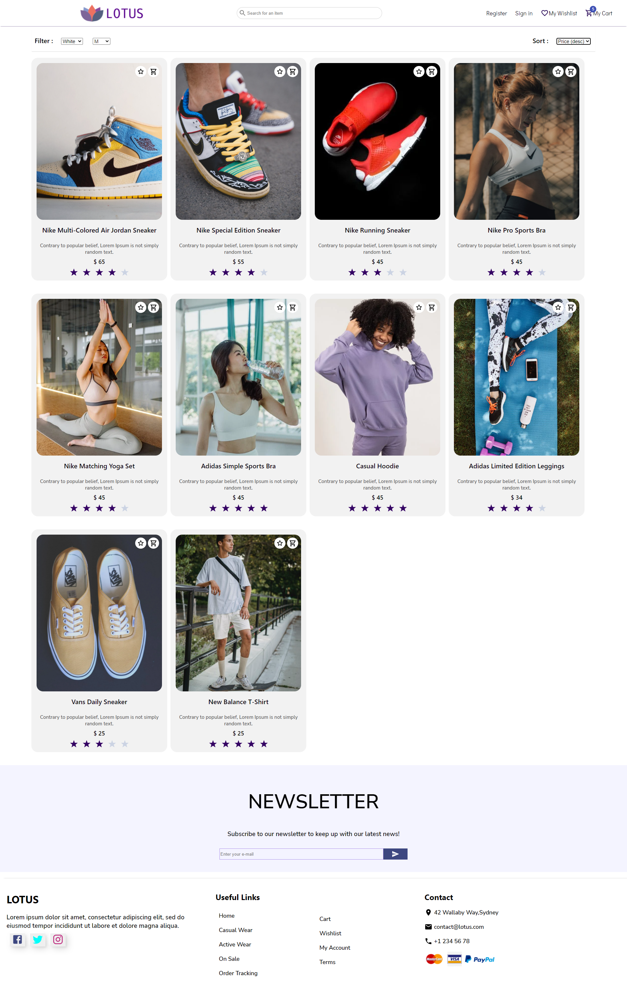
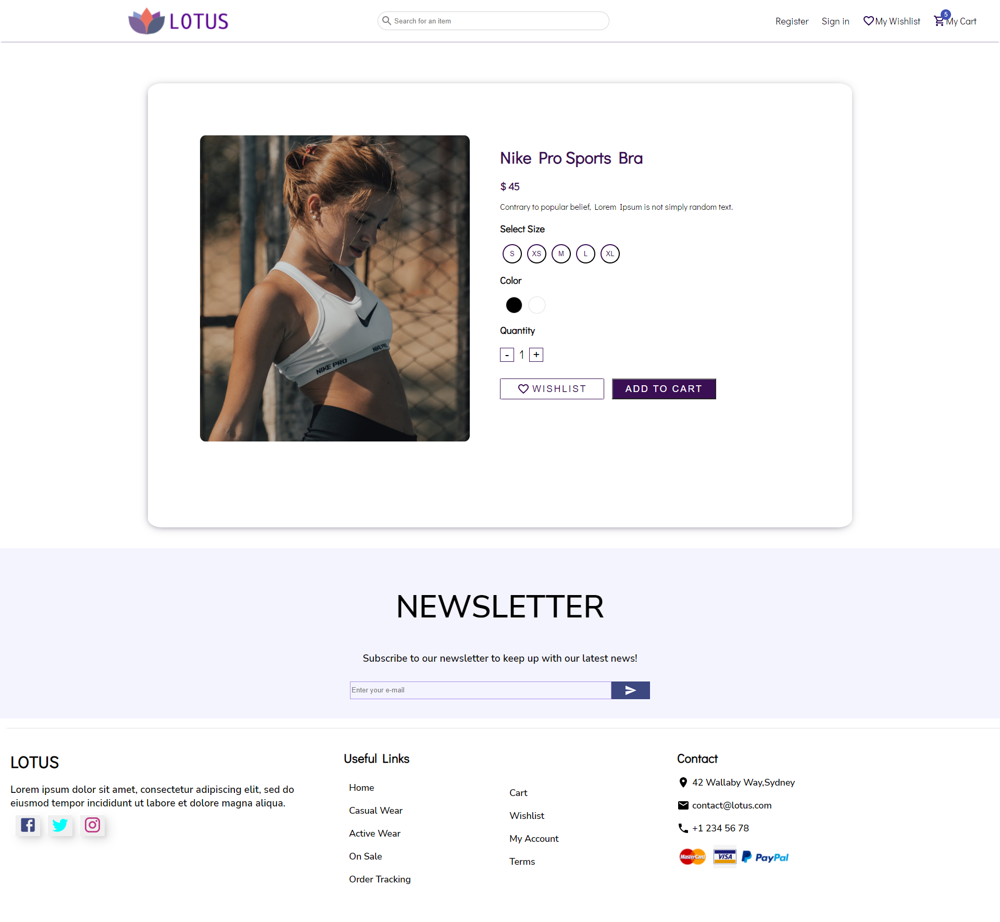
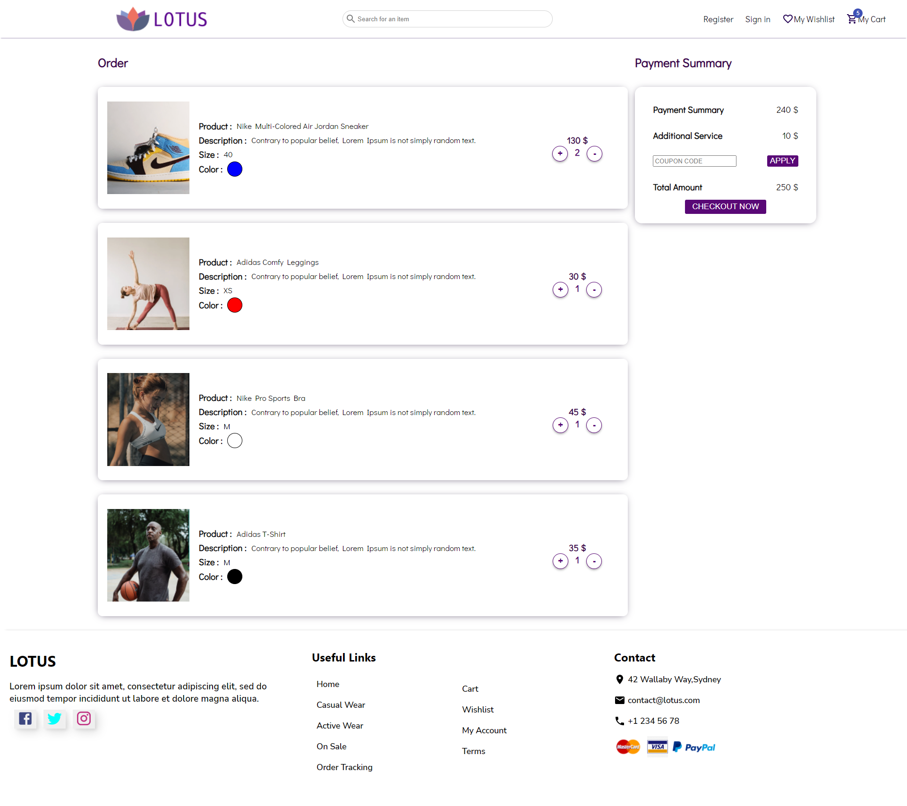
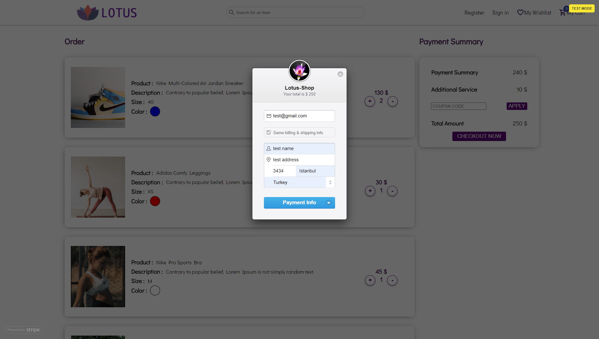

Full-Stack E-Commerce Project

This project is a full stack e-commerce project uses React on front-end, Redux for state management, NodeJS on back-end and MongoDB as database.
JWT used for authentication and Stripe used for peyment methods.

On home page of application firstly there is a navbar that has searchbar in it that user can search for an item. 
On the right side sign in/register buttons redirects user to sign in/register pages.
On Wishlist/Shopping Cart part of navbar user can see how many items currently in cart. The state of cart manages with Redux.

Second part of the home page is a page-size slider that done with css. This slider has a timeout function, in every 5 seconds showss user a new poster unless user triggers the poster change buttons.
After that there are three categories Casual Wear/Active Wear/On Sale. User can click these containers and react-router-dom redirects user to products page.
Every product has one or more keys such as ["casual","sale"] when redirecting to products page products that only has keys that user selected retrieves from MongoDB service and displays on UI.
On Popular this month part there is a Carousel Container that basically slides and shows user different products one by one.

On Products Page, firsly data is retrieved from MongoDB and map operation performed on fetched data and products shown sperately.
User can filter product by tehir size and color properties and sort them by their price or the date that they added to database.

Whenever user click on an item react router dom redirects user to products page and modifys url based on products id that has read from database.
On single product page user can select a color/size and quantity and either can add to wishlist or cart.

On shopping cart user can see all items added to shopping cart, also user can add or remove items.
State of products managed with Redux.

If user clicks on Checkout now button Stripe payment triggers and payment pop-up window displays.
User can create dummy order with stripes dummy card number. [Check out](https://stripe.com/docs/testing)

